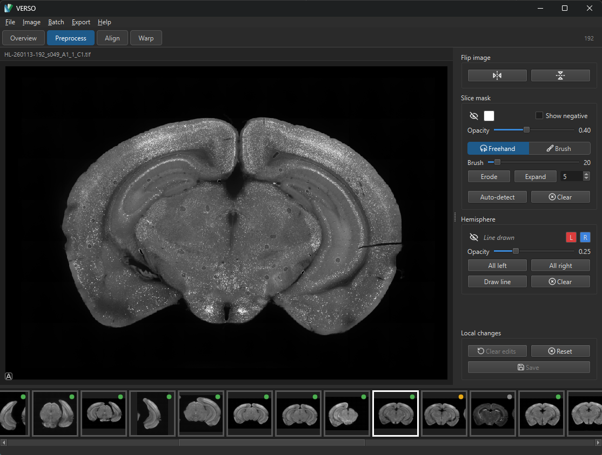

<div align="center">


# VERSO

[](https://www.python.org/downloads/release/python-31213/)
[](https://github.com/LeonardoLupori/verso/actions/workflows/tests.yml)

**V**erso, **E**asy **R**egistration of **S**ecti**O**ns

</div>

> [!WARNING]
> **Early development.** VERSO is under active development. Features, file formats, and APIs may change without notice, and you should expect rough edges. Back up your data and use at your own risk.

VERSO is a desktop application for registering serial histological brain sections to 3D reference atlases.

<div align="center">

</div>

## What it does

Histological brain sections imaged at high resolution need to be mapped onto a 3D reference atlas (such as the Allen Mouse Brain Atlas) before cell counts or signal measurements can be assigned to brain regions. This process traditionally requires several separate tools and manual file handoffs between them.

VERSO handles the entire workflow in one place:

- **Import** microscopy images (TIFF, OME-TIFF, PNG, JPEG), including 16-bit and multi-channel files
- **Preprocess** sections non-destructively: flip orientation, draw slice masks
- **Register** each section to the atlas by positioning an atlas overlay (anteroposterior position, rotation, scale) using an affine transformation
- **Warp** the atlas overlay onto curved or distorted sections using nonlinear control points (Delaunay triangulation, matching VisuAlign's algorithm)
- **Export** warped images, region-annotated data, and point clouds for downstream quantification

## Save time, be in control

VERSO's guiding philosophy is simple: **save you as much time as possible without ever becoming a black box.** Every automatic step produces an ordinary, fully editable result that you can inspect, accept, or override. Nothing is hidden, the automation gives you a strong starting point, and you keep complete manual control over the final data. This matters most on out-of-distribution datasets, where automatic tools were never tested and a human eye is essential.

Three features that make you faster:

- **DeepSlice-powered alignment.** With the optional [DeepSlice](https://github.com/PolarBean/DeepSlice) integration, VERSO predicts the atlas position and cutting angle for an entire series of sections at once. Because DeepSlice reasons about the whole series jointly, it recovers a consistent anteroposterior progression and angle across all your slices, giving you a solid affine starting point in a single click instead of positioning each section by hand.
- **Progressive interpolation for large serial datasets.** Borrowed from [QuickNII](https://github.com/Neural-Systems-at-UIO/QuickNII), this lets you align just a handful of keyframe sections by hand; VERSO linearly interpolates the atlas position and angle for every section in between. As you anchor more keyframes, the proposals for the surrounding sections refine progressively — so a whole serial dataset can be aligned by perfecting a few sections and letting the rest follow.
- **Automatic control-point placement for warping.** Warping normally means clicking dozens of matching points by hand to bend the atlas onto a distorted section. VERSO does this for you: it automatically figures out how each section is deformed relative to the atlas and drops control points onto recognizable landmarks (cortex, ventricles, hippocampus, midline, and more). You get a complete set of warp points to use as-is or adjust by hand. (Available for Allen mouse atlases.)

The output of all these automation steps is never locked: review the proposals, flag bad sections, and refine alignment or control points manually whenever you want.

## Is VERSO for you?

VERSO is designed to be **user-friendly and quick to pick up.** You should not need to read a manual or learn a pipeline of separate tools to get useful results.

That means VERSO works equally well across the experience spectrum:

- **A newly joined intern** who just needs to align two histological images can open the app, drop in their files, and get a clean registration with minimal training.
- **An experienced scientist** reconstructing an entire brain from a full serial dataset can lean on DeepSlice, progressive interpolation, and automatic control points to register hundreds of sections quickly.

## GUI overview

The interface has four views, switchable from the toolbar:

| View | Purpose |
|---|---|
| **Overview** | Table of all sections with pipeline status at a glance |
| **Prep** | Canvas for preprocessing — masks and flipping |
| **Align** | Canvas for affine atlas registration (AP position, rotation, scale), with DeepSlice proposals |
| **Warp** | Canvas for nonlinear refinement using automatic or manually placed control points |

A filmstrip of section thumbnails runs along the bottom of the Prep, Align, and Warp views for quick navigation.

## Compatibility

VERSO reads and writes the QuickNII/VisuAlign JSON alignment format natively, so projects can be exchanged with existing tools in the QUINT pipeline.

## Quick start

```bash
uv sync                          # install dependencies
uv sync --extra deepslice        # (optional) enable DeepSlice alignment proposals
uv run python -m verso           # launch the GUI
```

Requires Python 3.12 and [uv](https://github.com/astral-sh/uv).
